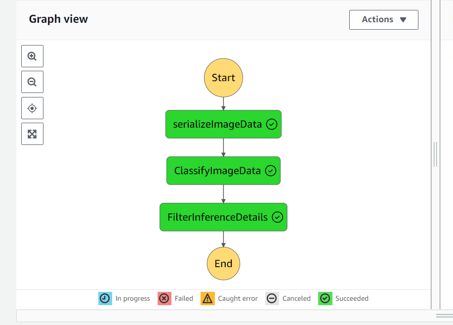
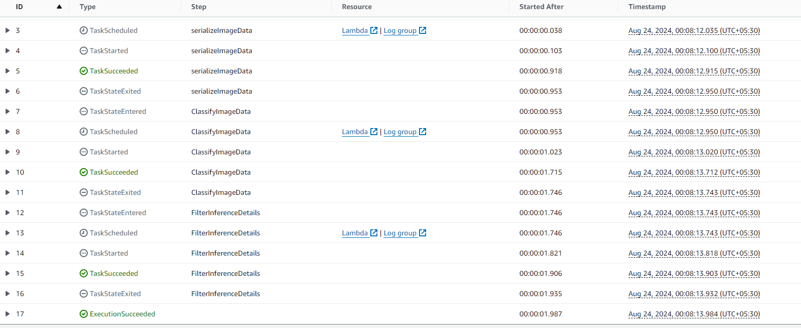
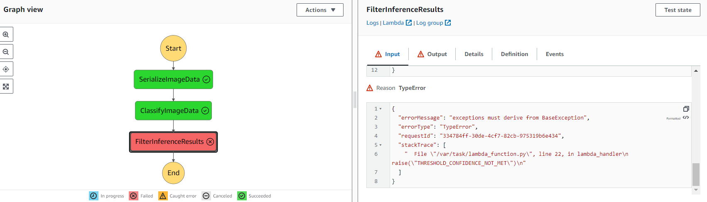
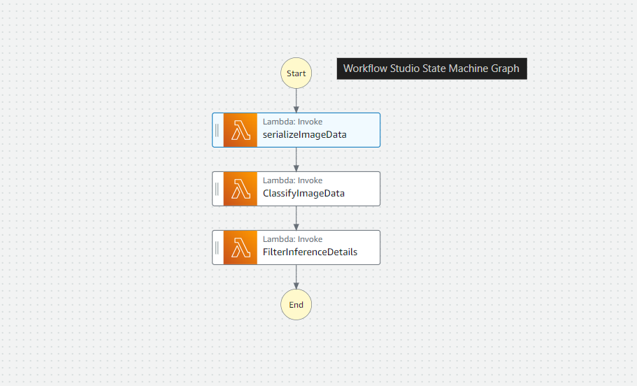

# ML WORKFLOW FOR SCONES UNLIMITED

## INTRODUCTION
In this project, we have built an image classification model that can automatically detect which kind of vehicle delivery drivers have, in order to route them to the correct loading bay and orders.
Assigning delivery professionals who have a bicycle to nearby orders and giving motorcyclists orders that are farther can help Scones Unlimited optimize their operations.
The image classification model can help the team in a variety of ways in their operating environment:
detecting people and vehicles in video feeds from roadways, better support routing for their engagement on social media, detecting defects in their scones, and many more
I have used AWS Sagemaker and its services to build the model and create a workflow to put the project in production and monitor its working thoroughly.

## 📌 Features

- End-to-end ML pipeline from data loading to model evaluation
- Train/test split and feature scaling
- Logistic Regression classifier (can be extended to others)
- Performance metrics: Accuracy, Confusion Matrix, ROC Curve
- Visualizations for better understanding

## 🚀 Getting Started

1. Clone the repository:

   git clone (https://github.com/Ab-Champ/ML-Workflow-for-Scones-Unlimited.git)
   cd ml_workflow

2. Install dependencies:

   pip install -r requirements.txt

   If requirements.txt is not available, install manually:

   pip install pandas numpy matplotlib seaborn scikit-learn

3. Run the notebook:

   jupyter notebook ML_workflow.ipynb

## 🛠️ Skills & Tools Used

- Python 3
- Jupyter Notebook
- pandas, numpy (data handling)
- matplotlib, seaborn (visualization)
- scikit-learn (machine learning algorithms and evaluation)

## 📊 Visualizations & Logs

### ✅ Successful Execution

### ❌ Unsuccessful Attempt

### 📈 Execution Graph

### 🖼️ Screenshot

## 🧩 To-Do / Enhancements

- Add support for multiple classifiers (e.g., SVM, Random Forest)
- Hyperparameter tuning using GridSearchCV
- Save and load trained models (joblib/pickle)
- Optionally deploy the model with Flask or FastAPI

## 📄 License

This project is open-source and available under the MIT License.

